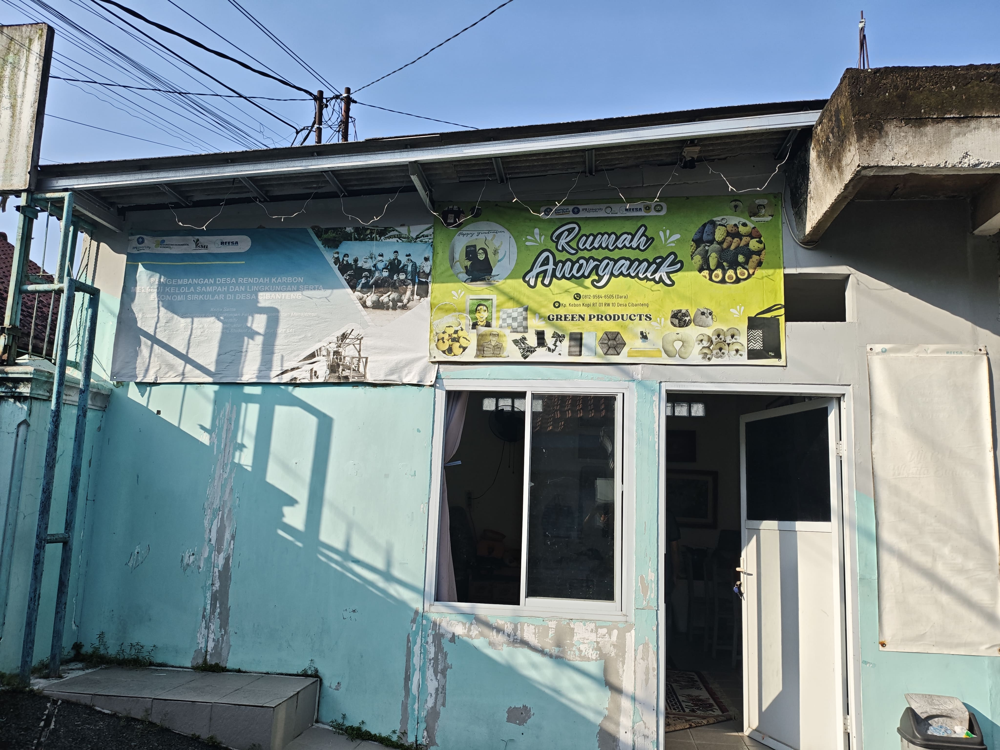

# Rumah Anorganik Cibanteng — Website

Website profil UMKM Bengkel Alam / Rumah Anorganik Cibanteng.

## 📁 Struktur Folder

```
rumah-anorganik/
├── index.html          ← File utama website
├── css/
│   └── style.css       ← Semua styling
├── js/
│   └── main.js         ← Interaktivitas (navbar, animasi, dll)
└── public/
    └── images/         ← Semua foto kamu taruh di sini
        ├── hero.jpg               ← Foto utama hero section
        ├── founder.jpg            ← Foto Bapak Mukhlis / tim
        ├── paving-block.jpg       ← Foto produk unggulan
        ├── produk-ecobrick.jpg
        ├── produk-asbak.jpg
        ├── produk-plakat.jpg
        ├── produk-konstruksi.jpg
        ├── produk-pot.jpg
        ├── mesin-cacah.jpg
        ├── mesin-melter.jpg
        ├── alat-cetak.jpg
        ├── gudang.jpg             ← 1 foto gudang bahan baku
        ├── lokasi-1.jpg           ← Foto tampak depan
        ├── lokasi-2.jpg           ← Foto area produksi
        ├── lokasi-3.jpg           ← Foto area pengolahan
        ├── kegiatan-limbah-plastik.jpg
        ├── kegiatan-pot-galon.jpg
        ├── kegiatan-sdn-dermaga.jpg
        ├── kegiatan-ubc.jpg
        ├── kegiatan-asia.jpg
        ├── kegiatan-korea.jpg
        └── kegiatan-peresmian.jpg
```

## 🖼️ Cara Ganti Foto

Di `index.html`, setiap placeholder foto ada komentar seperti ini:

```html
<!-- Ganti dengan:  -->
<div class="img-ph img-ph-hero">
  <span>📸</span>
  <p>Foto Utama Rumah Anorganik</p>
  <small>Ganti dengan: public/images/hero.jpg</small>
</div>
```

Tinggal **hapus seluruh `<div class="img-ph ...">...</div>`** dan ganti dengan:

```html

```

## 📱 Cara Ganti Nomor WhatsApp & Email

Di `index.html`, cari teks ini dan ganti:

```html
<!-- Nomor WA: ganti 628XXXXXXXXXX dengan nomor asli -->
<a href="https://wa.me/6281234567890" ...>+62 812-3456-7890</a>

<!-- Email -->
<a href="mailto:info@rumah-anorganik.id">info@rumah-anorganik.id</a>
```

Format nomor WA: `628` + nomor tanpa `0` di depan. 
Contoh: `0812-3456-7890` → `https://wa.me/6281234567890`

## 🗺️ Cara Pasang Google Maps

1. Buka [Google Maps](https://maps.google.com)
2. Cari "Desa Cibanteng Bogor"
3. Klik **Share → Embed a map**
4. Copy kode `<iframe ...>`
5. Di `index.html`, temukan bagian `<!-- Contoh iframe Google Maps -->` dan ganti `map-placeholder` dengan iframe tersebut.

## 🚀 Deploy ke Vercel

### Cara 1: Drag & Drop (Paling Mudah)
1. Buka [vercel.com](https://vercel.com) → Login
2. Klik **Add New → Project**
3. Pilih **Deploy without Git** → Drag folder `rumah-anorganik/` ke area upload
4. Klik Deploy → Selesai!

### Cara 2: Via GitHub (Direkomendasikan agar bisa update)
1. Upload folder ini ke GitHub (repository baru)
2. Di Vercel → Import Git Repository → pilih repo tersebut
3. Framework Preset: **Other** (static site)
4. Klik Deploy
5. Setiap kamu push ke GitHub, website otomatis update!

### Catatan Vercel
- Folder `public/images/` akan otomatis bisa diakses di URL `/public/images/namafile.jpg`
- Tidak perlu konfigurasi tambahan — ini pure static HTML/CSS/JS

## ✏️ Hal yang Perlu Diganti Sebelum Deploy

- [ ] Nomor WhatsApp di bagian Kontak dan footer
- [ ] Email di bagian Kontak dan footer  
- [ ] Google Maps embed untuk Desa Cibanteng
- [ ] Semua foto placeholder di folder `public/images/`
- [ ] Jam operasional (jika berbeda)
